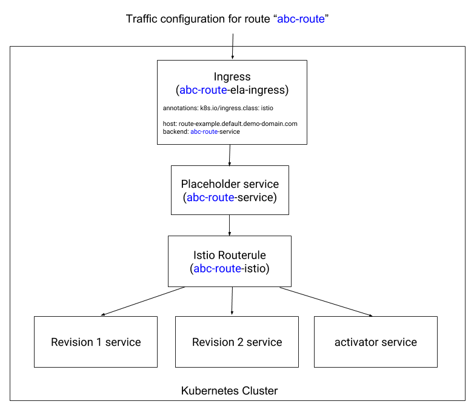
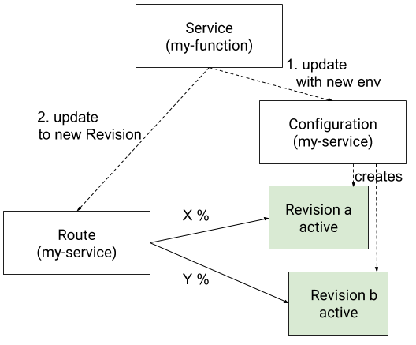
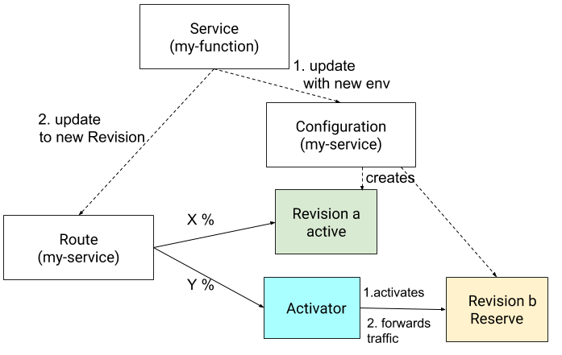

# The Activator Network Configurations

## Traffic configuration overview

An ingress object is created per Route to direct external traffic to reach desired revisions. This ingress
object has annotations "istio" so Istio is the ingress controller which fulfills the ingress. The ingress
uses domain based routing to map the requests to the placeholder service. The placeholder service is then
mapped to Istio routerules which control traffic across revisions and the activator service.

The picture below shows traffic configuration for a route "abc-route".



## Istio Route Rules Configurations

Knative Serving Route objects control traffic split via Istio route rules. When a revision is in Reserve state
due to inactivity, instead of letting the revision get traffic assignment directly, Route defines route
rules such that the activator gets the portion of traffic for the revision. Below are detailed description
for three cases.

### All revisions are active

When all revisions are active, the activator service does not get any traffic.
Below is an example where the route (my-service) has two traffic targets, Revision a and Revision b, and
both revisions are active. Note activator does not serve traffic.



### One revision is in Reserve state

When one revision is in Reserve state, the activator services gets its traffic assignment.
Below is an example where Revision a is active and Revision b is in Reserve. In this case, the Activator
gets traffic assignment for Revision b. Upon receiving requests, Activator activates Revision b and
forwards requests to Revision b after it is ready. After the revision is activated and ready to serve
traffic, the Revision b gets assigned portion of traffic directly.



### Multiple revisions are in Reserve state

When there are two or more revisions are in Reserve state, the Activator service gets traffic for all
Reserve revisions. Among Reserve revisions, Activator activates the revision with the largest traffic
weight, and forwards traffic to it. There is room for improvement for this behavior ([#882](https://github.com/knative/serving/issues/882)).
After the revision is activated and ready to serve traffic, activator gets the portion of traffic
for all the rest Reserve revisions.

## Sequence

Revisions are scaled to and from Reserve state with a two-phase transaction.

#### States

1. `Active` -- the Revision is actively serving traffic directly (not through Activator).
2. `ToReserve` -- the Revision should be placed into a `Reserve` state (deactivation phase one).
3. `Reserve` -- the Istio RouteRules have been updated to point to the Activator (deactivation phase two).
4. `Retired` -- the Revision has no routes or resources provisioned.

#### Statuses

1. `Idle` -- indicates the Revision has not received traffic recently.
2. `Reserve` -- indicates the Revision has been placed into the `Reserve` state.  Carries a timestamp used by the Revision controller.
3. `Ready` -- indicates the Revision has underlying resources capable of serving traffic.

### Deactivation

```
 +------------+   +----------+    +------------+   +-------+   +-------+   +-----------+
 | Autoscaler |   | Revision |    | Deployment |   | Route |   | Istio |   | Activator |
 +------------+   +----------+    +------------+   +-------+   +-------+   +-----------+
       |                |               |              |           |             |
       |                |<-----------------------------|           |             |
       |     Spec.      |               |    Watch     |           |             |
       | ServingState=  |               |              |           |             |
       |   ToReserve    |               |              |           |             |
       |--------------->|               |              |           |             |
       |                |---+           |              |           |             |
       |                |   |           |              |           |             |
       |                |<--+           |              |           |             |
       |                |   Status.     |              |           |             |
       |                |  Idle=True    |              |           |             |
       |                |               |              |           |             |
       |                |----------------------------->|           |             |
       |                |               |  Reconcile   |---------->|             |
       |                |               |              | RouteRule |             |
       |                |<-----------------------------| Activator |             |
       |            +---|     Spec.     |              |           |             |
       |            |   | ServingState= |              |           |             |
       |            +-->|    Reserve    |              |           |             |
       |      Status.   |               |              |           |             |
       |   Reserve=True |               |              |           |             |
       |       (t=0)    |               |              |           |             |
       |                |               |              |           |             |
       |            +---|               |              |           |             |
       |            |   |               |              |           |             |
       |            +-->|               |              |           |             |
       |    Reconcile   |-------------->|              |           |             |
       |       (t=10)   |     Spec.     |              |           |             |
       |                |  Replicas=0   |              |           |             |
       |                |               |              |           |             |

```

First the Autoscaler requests
transition to Reserve by updating Revision Spec to the ToReserve state.  The Revision controller marks
the Revision Status as Idle.  Then the Route Controller updates Istio RouteRules to point traffic for
the Revision to the Activator.  Once the route has been successfully updated, the Route controller
updates the Revision Spec to the Reserve state.  Then the Revision controller updates the underlying
Deployment Replica count to 0.

*Note: As a workaround for lack of Istio RouteRule Status, the Revision controller waits at least 10
seconds before actually updating the Deployment Recplica count, which allows for the route rules to
fully propagate.*

### Activation

```
 +------------+   +----------+    +------------+   +-------+   +-------+   +-----------+
 | Autoscaler |   | Revision |    | Deployment |   | Route |   | Istio |   | Activator |
 +------------+   +----------+    +------------+   +-------+   +-------+   +-----------+
       |                |               |              |           |             |
       |                |<-----------------------------|           |             |
       |                |               |    Watch     |           |             |
       |                |               |              |           |             |
       |                |<-------------------------------------------------------|
       |            +---|               |              |           |    Spec.    |
       |            |   |-------------->|              |           |ServingState=| 
       |            +-->|     Spec.     |              |           |    Active   |
       |      Status.   |  Replicas=1   |              |           |             |
       |    Idle=False  |<-------------------------------------------------------|
       | Reserve=False  |               |              |           |    Watch    |
       |            +---|               |              |           |             |
       |            |   |               |              |           |             |
       |            +-->|               |              |           |             |
       |      Status.   |               |              |           |             |
       |    Ready=True  |----------------------------->|           |             |
       |                |               |   Reconcile  |           |             |
       |                |------------------------------------------------------->|
       |                |               |              |           |  Reconcile  |
       |                |               |<---------------------------------------|
       |                |               |   Forward    |           |             |
       |                |               |              |           |             |
```

First the Activator transitions the Revision to ServingState Active.  Then the Revision controller
increases the Deployment Replica count to 1.  Once the Pod is ready, the Endpoint object is updated
with a health IP address and the Revision controller marks the Revision as Status Ready.  The Route
controller then updates the Istio RouteRule to point directly to the Revision.  Meanwhile, the
Activator notices the Revision is Ready and forward pending requests to the Revision's service.
